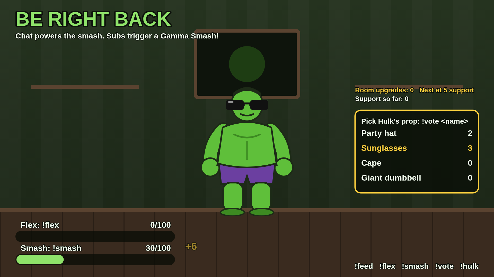

# Hulk's Hangout

A chat-controlled Hulk companion that lives in a destructible room on your Twitch stream. Viewers play from chat during your intro, breaks and outro; subscriptions trigger celebrations and unlock permanent room decorations for everyone. It runs on your PC and shows up in OBS as a **Browser Source**, so viewers install nothing.

- The build brief is in [docs/BRIEF.md](docs/BRIEF.md).
- The asset pack is explained in [docs/ASSETS.md](docs/ASSETS.md).
- The test results are in [docs/VERIFICATION.md](docs/VERIFICATION.md).

| Scene | What viewers see |
|---|---|
| **INTRO** | A sleeping Hulk, a starting-soon countdown and a chat-powered wake-up meter. |
| **LIVE** | A small transparent companion in the corner with restrained animations. |
| **BRB** | The full room: feeding, flexing, prop voting and community smashing. |
| **OUTRO** | A fixed countdown, supporter acknowledgements, cleaning up and bedtime; then a quiet end card. |



## Chat commands (all configurable in the dashboard)

| Command | Effect | Cooldown per viewer |
|---|---|---|
| `!hulk` | Shows how to play on the overlay (optional chat reply) | 60 s, plus a global limit |
| `!wake` | +5 wake energy (INTRO) | 20 s |
| `!feed` | Snack reaction (LIVE, BRB) | 30 s |
| `!flex` | +5 to the shared flex meter (LIVE, BRB) | 20 s |
| `!smash` | +5 smash energy (BRB) | 15 s |
| `!vote <option>` | Votes for a prop (hat, shades, cape, dumbbell, or 1–4); one vote per viewer, changes allowed | none |

Meters fill at 100. Progress is never lost or drained during quiet spells. Many commands at once become one combined reaction ("+40"), not 40 animations. Ordinary chat, bots, unknown commands and messages from other channels in shared chat are ignored.

## Subscription rewards

| Event | What happens |
|---|---|
| **New subscription (not a gift)** | A named "Gamma Flex" celebration, a supporter acknowledgement and +1 support unit. |
| **Resub message** | A welcome-back animation with the reported months. It's counted separately and adds no support units, because a shared resub message isn't proof of every renewal. |
| **Gift batch** | One supply-drop-and-smash sequence showing the quantity, and +N support units. The individual gifted-sub notifications are not counted again. |
| **Anonymous gifts** | Shown as "Anonymous". The gifter's identity is never looked up or inferred. |
| **Every 5 support units** | One permanent room decoration for everyone. Each milestone is awarded once, even when one batch crosses several. |

Single celebrations last under 8 s and a gift batch's whole sequence under 12 s. Under heavy activity, celebrations fold into one "Thank you, supporters!" summary instead of queuing forever. Countdowns are never extended by subs: the outro ends on time.

---

## Setup (Windows)

### 1. Install

1. Install **Node.js 22 LTS** (22.13 or newer) from https://nodejs.org. Node 24 also works.
2. Download this repository (Code → Download ZIP) and extract it, or `git clone` it.
3. Open **PowerShell** in the folder and run:
   ```
   npm install
   npm run build
   ```

You can try it now without Twitch: `npm start`, then open http://localhost:3977/demo.

### 2. Register the Twitch application

1. Go to https://dev.twitch.tv/console/apps and click **Register Your Application**.
2. Fill in the form:
   - **Name:** anything unique, for example `hulks-hangout-yourname`.
   - **OAuth Redirect URLs:** exactly `http://localhost:3977/auth/callback`. If you change `HH_PORT`, use that port instead.
   - **Category:** Chat Bot (or Other). **Client Type:** Confidential.
3. Click **Create**, then **Manage**. Copy the **Client ID**, click **New Secret** and copy the **Client Secret**.

### 3. Configure

Copy `.env.example` to `.env` and fill in:
```
TWITCH_CLIENT_ID=...
TWITCH_CLIENT_SECRET=...
```
Never commit or share `.env` or the `data/` folder. Together they hold your client secret, your Twitch tokens and the dashboard key.

### 4. Sign in as the broadcaster

1. Run `npm start`. Keep this window open for the whole stream.
2. Open http://localhost:3977/dashboard and click **Sign in with Twitch**. Sign in with the **broadcaster** account and approve.

The app asks for these permissions:
- `user:read:chat`, to read chat commands.
- `channel:read:subscriptions`, for sub, resub and gift events.
- `user:write:chat`, only if you turn on chat replies to `!hulk`. Sign in again after turning it on.

The Twitch panel then shows **connected**, your account, and four event subscriptions marked *enabled*.
- **Subscription events need an Affiliate or Partner channel.** Without one, the panel says *chat only*, and all chat commands still work.

### 5. Add it to OBS

1. In OBS, go to **Sources → + → Browser**.
2. URL: **`http://localhost:3977/overlay`**.
3. Width **1920**, height **1080**. Leave *Custom CSS* empty: the page background is already transparent.
4. Tick **Control audio via OBS** so the overlay's sounds get their own mixer slider.
5. Untick *Shutdown source when not visible*. Leave *Refresh browser when scene becomes active* unticked.
6. Add the same source to your Starting Soon, main, BRB and Ending scenes, or use one source in a nested scene. Several copies are fine: they only display state, so nothing is ever awarded twice.

**Scene switching:**
- **Manual:** use the dashboard's INTRO, LIVE, BRB and OUTRO buttons.
- **Changing OBS scenes doesn't change the mode.** Automatic OBS scene sync is a possible later feature.
- **Optional room background:** `/overlay?bg=room` shows the room behind the LIVE companion. Without it, LIVE is transparent.

**Audio:**
- **Where the sound goes:** it plays through the browser source, so it goes wherever OBS sends that source (stream and recording).
- **Hearing it yourself:** set the source to *Monitor and Output* in **Advanced Audio Properties**.
- **Volume and mute:** both are in the dashboard.

**The server must keep running.** The overlay is just a window onto it. Hiding a source doesn't stop the game, and closing the server stops everything.

### Pre-stream checklist

1. Start the server with `npm start` and leave the window open.
2. Check the dashboard shows **server connected** and Twitch **connected**, with the subscriptions *enabled*. If the panel says *chat only*, that's expected on non-affiliate channels.
3. Make sure the OBS browser source shows the overlay. Right-click it → *Refresh* if it doesn't.
4. Press **Start session (intro)** in the dashboard and check the countdown.
5. Optional: open `/demo` to preview effects. That session is separate and never changes your real totals.

### Recovery

| Problem | Fix |
|---|---|
| **Twitch disconnected** or *reconnecting* | It retries on its own, with increasing waits. If it stays down, click **Reconnect**. Events during the gap aren't replayed (Twitch doesn't resend them), and the gap is listed in the Twitch panel. |
| **Missing permissions** / *signed-out* / *authorisation expired* | Click **Sign in with Twitch** again. This happens if you revoked the app on twitch.tv, changed your password, or turned on chat replies. |
| **Silent audio** | Check the dashboard isn't muted and the volume is up. In OBS, check the browser source's mixer slider, that *Control audio via OBS* is ticked, and its monitoring setting. Right-click the source → *Refresh* once. |
| **Frozen overlay** | Right-click the browser source → *Refresh*. It reconnects and shows the current state, and finished celebrations don't replay. If every overlay is frozen, check the server window is still running. |
| **Something is going wrong live** | Press **EMERGENCY STOP**. Every effect stops immediately and commands are blocked until **Resume**. |
| **Wrong scene** | Click the right mode in the dashboard. Each mode button starts that scene's countdown, and you can edit the seconds next to it. |

---

## Commands for developers

| Command | What it does |
|---|---|
| `npm run dev` | Rebuilds the pages and restarts the server on file changes. |
| `npm run build` | Production build into `dist/`. |
| `npm start` | Runs the built server. The OBS URL is http://localhost:3977/overlay. |
| `npm run demo` | Builds and starts. Then open http://localhost:3977/demo. |
| `npm test` | Unit and integration tests (Vitest). |
| `npm run typecheck` | TypeScript, browser and server. |
| `npm run test:smoke` | Headless-browser smoke test of the overlay and dashboard, and writes `docs/screenshots/`. It needs Chromium: set `CHROMIUM_PATH` or run `npx playwright install chromium`. |
| `npm run test:load` | Runs 100 commands per second for 60 s against the demo session, with an overlay open, and writes `docs/load-test-results.json`. |
| `npm run assets` | Regenerates the placeholder asset pack. |

**Supported runtime:** Node.js **22.13+** (tested on 22.22) or Node 24. It uses Node's built-in SQLite (`node:sqlite`), so there's no native module to compile on Windows.
- **The warning at startup:** Node 22 labels `node:sqlite` experimental. The npm scripts pass `--no-warnings=ExperimentalWarning` to hide that notice.

## How it works

```text
Twitch chat + subscription events
              |
       EventSub WebSocket  (wss://eventsub.wss.twitch.tv/ws, user access token)
              |
Twitch adapter -> validated internal events -> authoritative state engine
 (src/server/twitch)  (CHAT_COMMAND, NEW_SUB,      (src/server/engine)
                       GIFT_BATCH, RESUB_MESSAGE)    |            |
                                                  SQLite     local WebSocket (/ws)
                                                     |            |
                                          ledger, room,     /overlay (Canvas, read-only)
                                          outbox, session   /dashboard (React)  /demo
```

- **One authority:** the backend owns the timers, energy, cooldowns (keyed by Twitch user ID), votes, progression and the animation timeline. Overlays only draw snapshots. A late-joining or reloaded overlay gets the current state, and finished celebrations aren't in it.
- **Exactly-once rewards:** every subscription event's EventSub `message_id` goes into a unique ledger. The room update, the celebration "outbox" and the session state commit in the same SQLite transaction. A redelivered message (before or after a restart) changes nothing. A crash mid-celebration resumes that celebration; it is never awarded twice.
- **Live and demo are separate engines:** the demo has its own in-memory database and can't reach live totals. Only real EventSub notifications reach the live engine.
- **Security:**
  - **Network:** the server binds to `127.0.0.1` only, and every request's `Host` and `Origin` are checked.
  - **Dashboard:** every dashboard change needs a per-install token, which only the dashboard page carries.
  - **Overlays:** they're read-only.
  - **Usernames:** they're always drawn as plain text, never HTML.
  - **Chat and sub messages:** their text is never displayed.
  - **Credentials:** tokens and the client secret stay on the backend in `data/` (file mode 600 on macOS/Linux). They're redacted from logs and never put in URLs or the frontend bundle. On Windows, keep the project folder in your user profile.
- **Metrics:** unique command participants, accepted interactions and observed support events, per mode with timestamps. User IDs only, never chat history. They're for comparing sessions, not proof that the overlay caused a subscription.

## Known limitations

- **Live Twitch not yet tested:** the connection has only been tested against a scripted fake of Twitch, not twitch.tv. See [docs/VERIFICATION.md](docs/VERIFICATION.md) for the live checklist.
- **No OS-level token encryption:** tokens are stored in a private file, not the Windows credential store.
- **Cooldowns reset on restart:** they live in memory. Up to about 1 s of chat energy can be lost if the server crashes; rewards are not affected.
- **Placeholder art:** replace it with the streamer's own via [docs/ASSETS.md](docs/ASSETS.md).
- **Not in the MVP:** OBS scene sync, a separate bot account, and subscriber-only outfit nominations.
